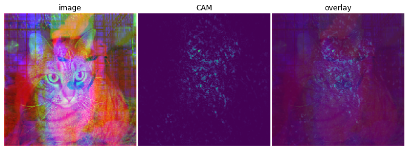

# ChannelGradCAM
ChannelGradCAM helps to answer how different channels in the input image play a role in the performance of CNNs. Regularly, the pre-trained models on ImageNet take the input with 3 channels, representing for colors: Red, Green and Blue. However, it is hard to say which channel is the most important for the prediction.

To demonstrate the performance of ChannelGradCAM, we will introduce inductive biases into the model so that the first channel (`channel1`) plays a key role in the prediction, regardless of the other channels. This is addressed by changing the `channel2` and `channel3` to random images of the same class or different class. To be more specific, we tried to classify `dog` and `cat` based on the `channel1`. The pre-trained model `resnet50` on ImageNet is used to re-train on our generated datasets.

Here are examples of the input images together with their corresponding labels:


**Method:**
LayerCAM ([Jiang *et al.*](https://ieeexplore.ieee.org/document/9462463)) allows visualizing the fine-grained class activation map at shallow layers of a CNN. If we do not take weighted-average of the feature maps and ReLU of gradients, we can visualize the class activation map for each channel. But we cannot backpropagate from loss to input image so we can't calculate the gradients for each input channel. The most shallow layer in `resnet50` we can calculate LayerCAM is the first convolutional layer `conv1_conv` (64 channels, which are not corresponding to 3 input channels). To overcome this, ChannelGradCAM add a `Conv2D` layer with the size of `(1,1,3,3)` [WxHxDxn_filters], called `channel_conv`, before the `conv1_conv` layer. We set weights of `channel_conv` to be `[[[[1., 0., 0.], [0., 1., 0.],[0., 0., 1.]]]]` and bias to be `[0.,0.,0.]` so that the output of `channel_conv` is the same as the input image (`channel_conv` plays as an `Identity` layer). Now, applying `LayerCAM` on `channel_conv` will give us the class activation map for each input channel.

**Results:**
<table>
<thead>
  <tr>
    <th></th>
    <th></th>
    <th>Visualize</th>
  </tr>
</thead>
<tbody>
<tr>
    <td colspan="2">Inputs</td>
    <td></td>
  </tr>
  <tr>
    <td rowspan="2">Image + LayerCAM</td>
    <td>Our model</td>
    <td></td>
  </tr>
  <tr>
    <td>Pre-trained ResNet50</td>
    <td></td>
  </tr>
  <tr>
    <td rowspan="2">ChannelGraCAM</td>
    <td>Our model</td>
    <td></td>
  </tr>
  <tr>
    <td>Pre-trained ResNet50</td>
    <td></td>
  </tr>
</tbody>
</table>

---

## How to use
### Google Colab
* Run on Google Colab to observe more cases with ChannelGradCAM: [https://colab.research.google.com/github/nguyenhoa93/ChannelGradCAM/blob/master/visualization.ipynb](https://colab.research.google.com/github/nguyenhoa93/ChannelGradCAM/blob/master/visualization.ipynb)

### On your own resources
* Download data: https://www.kaggle.com/competitions/dogs-vs-cats/data
* Clone this repository: `git clone https://github.com/nguyenhoa93/ChannelGradCAM && cd ChannelGradCAM`
* Create virtual environment:
```
conda create -n channel-cam python=3.9
conda activate channel-cam
pip install -r requirements.txt
```

* Train (optional): `python train.py --imdir [PAT/TO/IMAGE/DIRECTORY] --epochs [EPOCHS]`. If you don't want to train, just down load the pretrained `model.h5` and place it under `assets` folder: `!gdown https://drive.google.com/uc\?id\=1A4ljWvyJfqyz-RwQkvYdZ8Kew0RrbCRa && mv model.h5 assets/model.h5`
* Observe more cases with ChannelGradCAM: [visualize.ipynb](./visualize.ipynb)

## References
* [LayerCAM: Exploring Hierarchical Class Activation Maps for Localization, Jiang *et al.*, *IEEE Transactions on Image Processing*, 2021.](https://ieeexplore.ieee.org/document/9462463)

